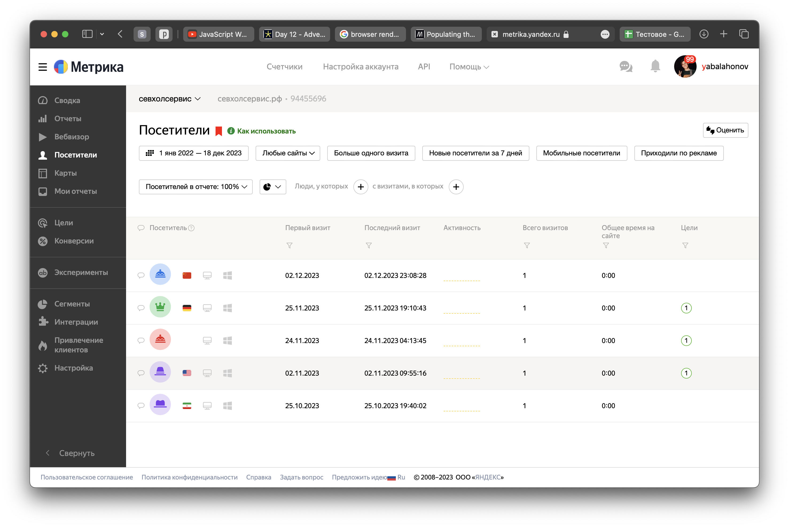

# Тестовое задание: Перевод Яндекс.Метрики в Google Sheets

На моём заброшеном сайте была установлена метрика которая зарегистрировала 5 посещений пользователей



Я написал скрипт который переводит эту метрику в Google Sheets используя Yandex.Metrics API и Google Sheets API. В API ключи лежат в .env и .credentials.json соответственно.

[Таблица](https://docs.google.com/spreadsheets/d/1-OtRd-11lSh3zhS0EIthUUma9cbZSAo8DxdxTuZcRvk/edit?usp=sharing)

Я исполнял скрипт Bun'ом, потому что там уже есть fetch() и удобный доступ к файлам окружения

```bash
# Пример кода Bash
bun run run.js
```

Чтобы таблица обновлялось n-ное время нужно настроить cron на продакшн сервере. У API есть ограничения на количество запросов в секунду.
